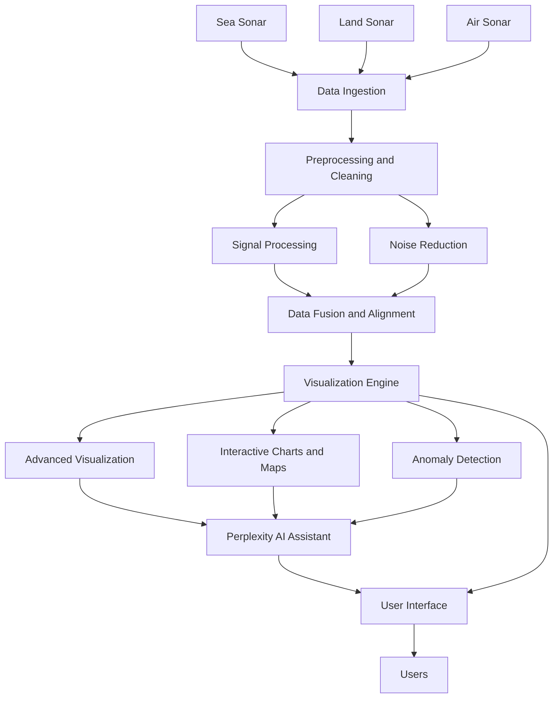

```mermaid
flowchart TD
    Sea[Sea Sonar]
    Land[Land Sonar]
    Air[Air Sonar]
    Ingest[Data Ingestion]
    Clean[Preprocessing and Cleaning]
    Signal[Signal Processing]
    Noise[Noise Reduction]
    Fusion[Data Fusion and Alignment]
    Viz[Visualization Engine]
    AdvViz[Advanced Visualization]
    Charts[Interactive Charts and Maps]
    Patterns[Anomaly Detection]
    AI[Perplexity AI Assistant]
    UI[User Interface]
    Users[Users]

    Sea --> Ingest
    Land --> Ingest
    Air --> Ingest

    Ingest --> Clean
    Clean --> Signal
    Clean --> Noise
    Signal --> Fusion
    Noise --> Fusion
    Fusion --> Viz
    Viz --> AdvViz
    Viz --> Charts
    Viz --> Patterns
    AdvViz --> AI
    Charts --> AI
    Patterns --> AI
    AI --> UI
    Viz --> UI
    UI --> Users
```
