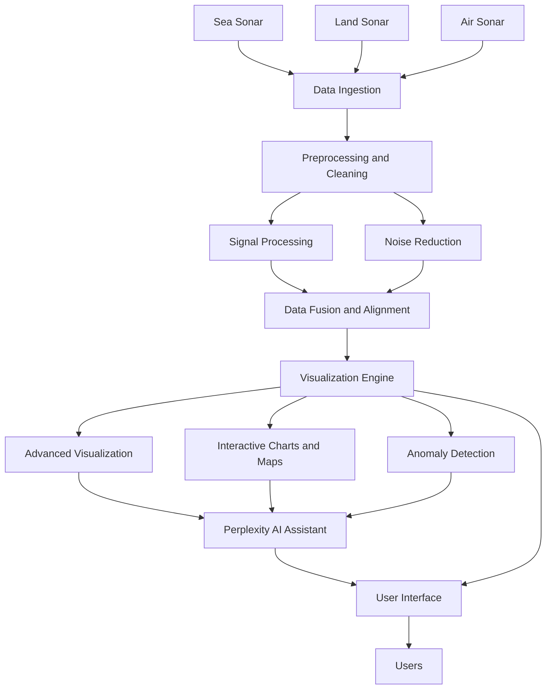

# Sonar Analysis Hub 📡 (with Perplexity AI)

**Entry for the Perplexity AI Hackathon**

[](https://www.python.org/)
[](https://streamlit.io)
[](https://perplexity.ai)
<!-- Add other badges if relevant (e.g., License: MIT) -->
**Devpost Submission:** [Sonar Analysis Hub (Sea, Land, Air) with Perplexity AI]([https://devpost.com/software/world-movers-ai-agent-customer-service-marketing-agent](https://devpost.com/software/sonar-analysis-hub-with-perxplexity-ai?ref_content=user-portfolio&ref_feature=in_progress))
*(Note: This is a project developed for the "AI in Action: Google Cloud Hackathon")*

## 🚀 Live Demo

#### 🤖✈️👉 **[Launch the Sonar AI][(https://world-movers-ai-agent-assistant-1075731580935.us-central1.run.app/)](https://sonair.streamlit.app/)** *(Link to be updated if necessary)*

The Sonar Analysis Hub is a web-based application designed for exploring  sonar data, uploading user-specific sonar-related files, and leveraging the analytical capabilities of Perplexity AI's Sonar models for insights and assistance.

Built with Streamlit, it provides an intuitive interface for users to visualize different types of  sonar scans (Sea, Land, Air), generate new scan data, upload their own images or data files, and interact with an AI assistant powered by Perplexity AI.


---

## ✨ Features

*   **🤖 Perplexity AI Sonar Assistant:** Interact with an AI assistant to ask questions about sonar principles, data interpretation, target classification, or the hub's functionalities. The AI can also discuss user-uploaded content.
*   **🛰️ Explore  Scan Data:**
    *   Load and visualize details from pre-defined sonar scans (Side-Scan Sonar, GPR, Ultrasonic).
    *   View scan metadata, parameters, summaries, and  spectrograms/radargrams.
    *   Examine lists of detected targets with their characteristics.
    *   Download scan data in JSON format.
*   **💡 Simulate New Sonar Scans:**
    *   Configure parameters (sonar type, area, frequency, range/depth, custom notes) to generate new  sonar scan data.
    *   View and download the results of these simulations.
    *   Optionally add new simulations to the "Explore Scan Data" list for the current session.
*   **⬆️ Upload & Analyze Sonar Data:**
    *   Upload sonar-related images (PNG, JPG, JPEG) for display.
    *   Upload sonar-related data files (CSV, TXT) for preview.
    *   Engage the Perplexity AI Assistant to discuss uploaded images (by name/reference) or analyze text snippets from uploaded data files.
*   **🛠️ Sonar Technologies Information:**
    *   Access descriptive information about various sonar technologies like Side-Scan Sonar (SSS), Multi-Beam Echosounders (MBES), Ground Penetrating Radar (GPR), Ultrasonic Sensors, and the role of AI in sonar classification.
*   **🎨 Themed UI:** Custom-styled Streamlit interface with a dark, modern aesthetic suitable for data analysis.

---

## 🏗️ Prerequisites

*   Python 3.8+
*   Git (for cloning the repository)

---

## 🛠️ Technology Stack

*   **Framework:** Streamlit
*   **AI Model:** Perplexity AI Sonar Models (e.g., `sonar-pro`) via the `openai` Python library.
*   **Data Handling & Numerics:** `pandas`, `numpy`
*   **Plotting & Visualization:** `plotly.express`
*   **Image Handling:** `Pillow` (PIL)
*   **API Interaction (for Perplexity):** `openai`
*   **File Handling:** `io`, `json`
*   **Utilities:** `datetime`, `time`, `re`

---

## 📃 Repository Structure

```
Sonari-AI/
├── .streamlit/
│   ├── secrets.toml          # Your actual API keys (gitignored)
│   └── secrets.toml.example  # Example for API keys
├── app.py                    # Main Streamlit application code
├── requirements.txt          # Python dependencies
├── README.md                 # This file
└── .gitignore                # Files to be ignored by Git
```
*(Note: Additional assets like images for the UI could be placed in an `assets/` directory if desired)*

---

## 🚀 Setup & Installation

1.  **Clone the Repository:**
    ```bash
    git clone <your-repository-url>
    cd Sonar-AI
    ```

2.  **Create and Activate Virtual Environment (Recommended):**
    ```bash
    python -m venv venv
    # On Windows:
    # .\venv\Scripts\activate
    # On macOS/Linux:
    # source venv/bin/activate
    ```

3.  **Install Dependencies:**
    ```bash
    pip install -r requirements.txt
    ```

4.  **Configure Secrets for Perplexity AI:**
    *   If it doesn't exist, create the `.streamlit` directory in the project root: `mkdir .streamlit`
    *   Copy the example secrets file:
        ```bash
        # On Windows (PowerShell):
        # copy .streamlit\secrets.toml.example .streamlit\secrets.toml
        # On macOS/Linux:
        # cp .streamlit/secrets.toml.example .streamlit/secrets.toml
        ```
    *   Open `.streamlit/secrets.toml` with a text editor.
    *   Replace `pplx-YOUR_PERPLEXITY_API_KEY_HERE` with your actual Perplexity AI API key.
```
# Copy this file to .streamlit/secrets.toml and fill in your API key.
# IMPORTANT: DO NOT commit your actual secrets.toml file to version control.

[perplexity_api]
api_key = "pplx-YOUR_PERPLEXITY_API_KEY_HERE"

# Example for a potential future Sonar Data API (currently a placeholder in the app)
# [sonar_data_api]
# base_url = "YOUR_SONAR_DATA_API_ENDPOINT"
# api_key = "YOUR_SONAR_DATA_API_KEY"
```
*   **IMPORTANT:** The `.gitignore` file is configured to prevent `secrets.toml` from being committed to version control. **Never commit your actual secrets file.**

---

## ▶️ Running the App

Ensure your virtual environment is activated and you are in the project's root directory (`Sonar-AI/`).

Run the Streamlit application using:

```bash
streamlit run app.py
```

The application should then open in your default web browser.

---

## Flowchart 📊


## 🤖 AI Integration Notes

*   The AI Assistant leverages Perplexity AI's Sonar models. Ensure your API key is correctly configured.
*   **Image Analysis:** When you upload an image and ask the AI about it, the AI does *not* receive the image data directly. It will attempt to discuss the image based on its filename (if you mention it) and your textual description or query. The system prompt guides the AI on this.
*   **Data File Analysis:** For uploaded CSV or TXT files, a text preview (a snippet of the content) *is* sent to the Perplexity AI model along with your query when you ask it to analyze the file.
*   **Context Handling:** Context from uploaded files (image references or text snippets) is typically cleared after one analysis query to the AI. This helps manage the conversation flow and API usage. You may need to refer to or re-upload a file if you wish to ask multiple, separate questions about it.
```
